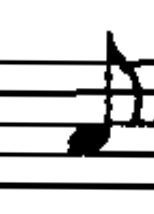
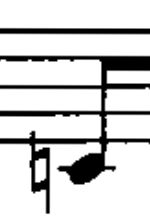
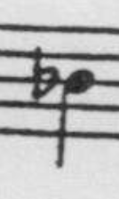
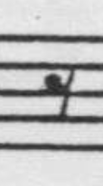
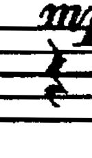
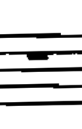
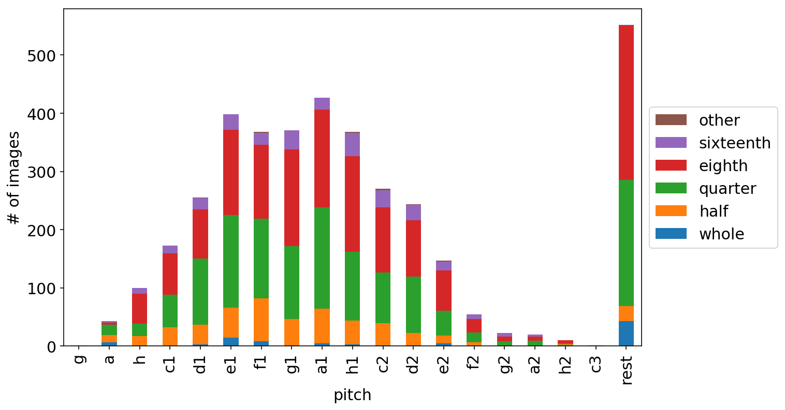
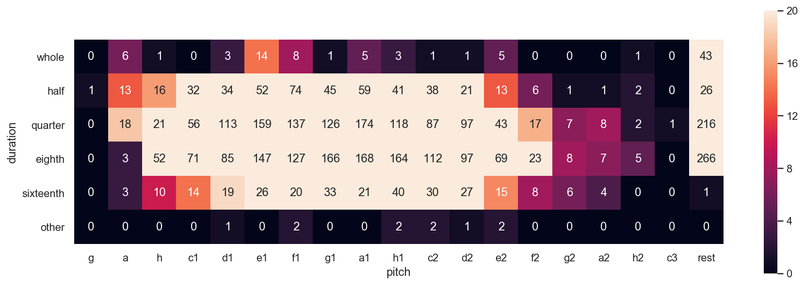

# OMR-clasification-dataset

Dataset created by [attoPascal](https://github.com/attoPascal) for Optical Music Recognition. You can download the original version in [his webpage](https://homepage.univie.ac.at/pascal.attwenger/bachelor/).


## Wrong labeling

The following changes from the original dataset have been done due to wrong labeling:

```
note-eighth-c1-3272 -> note-eighth-c2-3272
note-half-other-1223 -> note-half-g-1223
rest-half-2966 -> rest-whole-2966
rest-half-2991 -> rest-whole-2991
rest-half-3217 -> rest-whole-3217
rest-half-3999 -> rest-whole-3999
rest-half-4216 -> rest-whole-4216
rest-half-4296 -> rest-whole-4296
rest-half-4397 -> rest-whole-4397
rest-whole-4508 -> rest-half-4508
```

## Dataset distribution

Distribution of the dataset according to the duration of each figure (The class 'other' are mostly triplets):

|      	| whole 	| half 	| quarter 	| eighth 	| sixteenth 	| other 	|
|------	|-------	|------	|---------	|--------	|-----------	|-------	|
| note 	| 49    	| 449  	| 1184    	| 1304   	| 276       	| 10    	|
| rest 	| 43    	| 26   	| 216     	| 266    	| 1         	| 0     	|

<p align="center">
  
</p>

In the next heatmap we can see what classes are poorly represented:

<p align="center">
  
</p>
